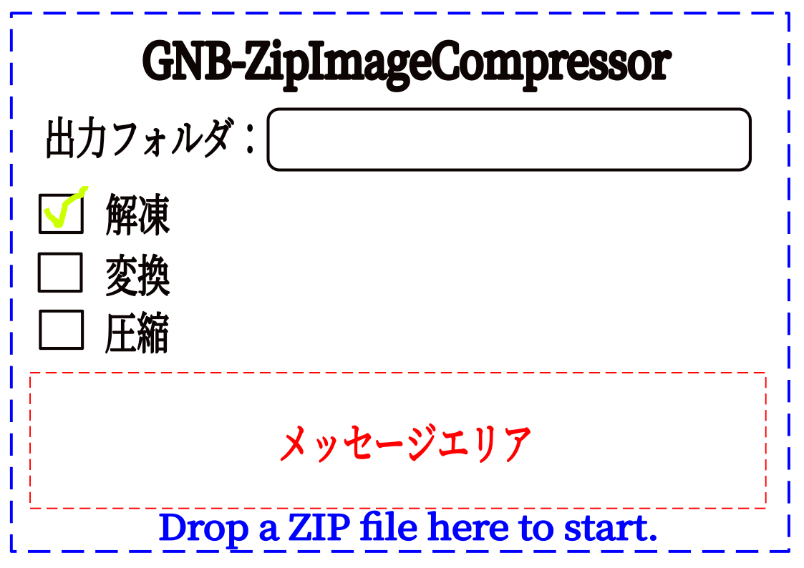

# GNB ZipImageCompressor

ZIPファイル内の画像を自動的にWebP形式へ変換し、再圧縮するデスクトップアプリケーションです。
Tauri v2 + Svelte 5 (Runes) で構築されており、高速かつ軽量に動作します。



## 主な機能

- **一括画像変換**: ZIP内の PNG, JPG, JPEG ファイルを WebP に変換し、ファイルサイズを削減します。
- **複数ファイル対応**: 複数のZIPファイルをドラッグ&ドロップ、またはコマンドライン引数から一度に処理可能です。
- **インテリジェント再圧縮**: すでに圧縮済みのファイル（WebP, 動画など）は再圧縮せずに格納し、処理の高速化と互換性を維持します。
- **モダンなUI**: 進捗状況が一目でわかる手順インジケーターと、詳細な実行ログを表示するコンソールを搭載。
- **全域ドロップエリア**: ファイルをウィンドウに近づけるとドロップエリアが拡大し、直感的な操作が可能です。

## 技術スタック

- **Frontend**: Svelte 5 (Runes), Tailwind CSS v4, Lucide Icons (SVG)
- **Backend**: Rust, Tauri v2
- **Libraries**:
  - `zenwebp`: 高性能なWebPエンコード
  - `image`: 画像デコード
  - `zip-rs`: ZIPアーカイブの操作
  - `rayon`: 並列画像処理による高速化

## セットアップ

### 開発環境の要件

- Rust (latest stable)
- Node.js (v20以上推奨)
- [Tauri 開発環境のセットアップ](https://v2.tauri.app/start/prerequisites/)

### 開発サーバーの起動

```bash
npm install
npm run tauri dev
```

### ビルド (Windows)

```bash
npm run tauri build
```

## ライセンス

MIT License
